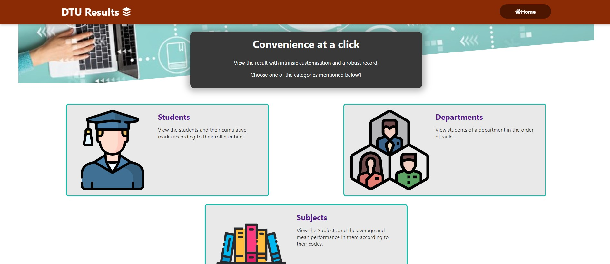
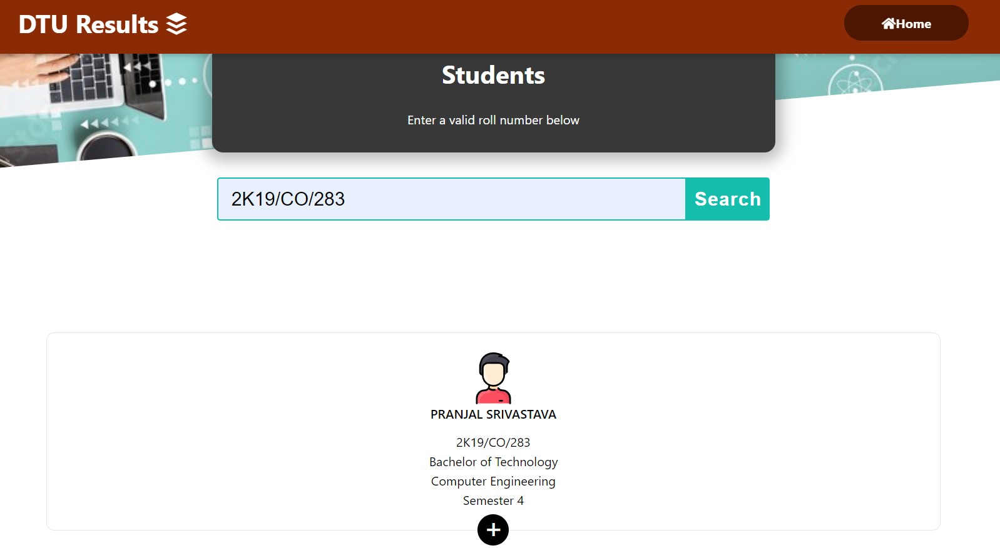
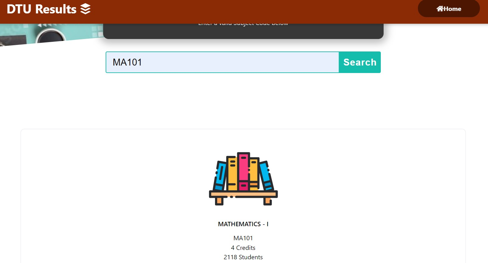
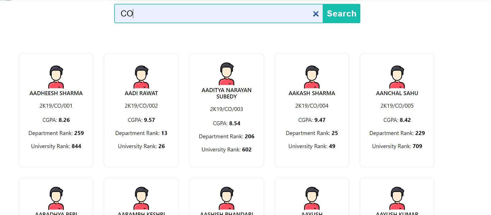

# Front end for DTU DB Web app
## A React Web app that scrapes resul documents of DTU and allows students to easily view the results assorted in various sections.

The website is hosted at https://dtu-db.web.app/  

The website allows you to view the result of a specific student, a subject or a department.

## Students
Students can view their result by entering their roll number.  

## Subjects
People can also view subject specific statistics and reults.  

## Departments
Results can also be viewed department wise with students arranged in their department ranks.  

----
## Run the app
In the project directory, you can run:  
### `npm start`

Runs the app in the development mode.\
Open [http://localhost:3000](http://localhost:3000) to view it in the browser.
